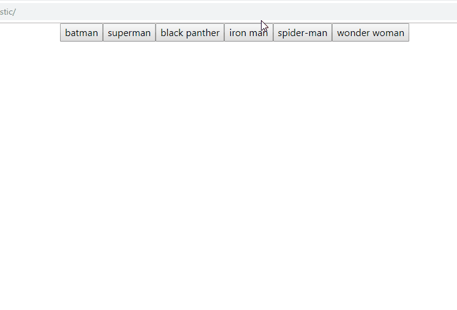
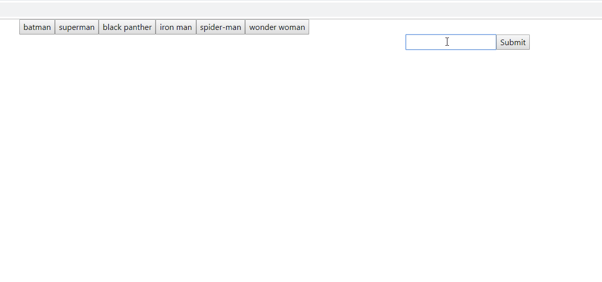

# GIFTastic - Superheroes

This project displays the use of multiple Javascript functions:
  - the use of on-click functions to begin an action
  - displaying objects pulled through the Giphy API
  - the use of on-click functions to play and pause the animation of GIFs
  - the use of a form to add buttons to the array of buttons
  - the use of Giphy's API to display the rating of each GIF displayed
  
 Here is a GIF of the app calling a list of GIFs and playing/pausing animation with an on-click command:
 
 </img>
 
 Here is a GIF of the app adding to the list of buttons and displaying the same function after being added:
 
 </img>

Improvements:
  - More styling overall (background, containers, buttons, etc.)
  - More consistent calls. It seems that only every other GIF becomes animated when clicked on

https://frankeydee.github.io/GIFTastic/
